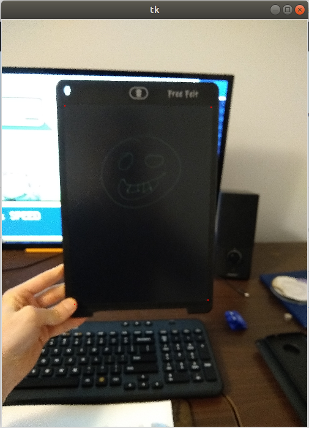

# Image_Labeling_Utils
Simple functions which assist in hand labeling images for machine learning purposes

## multipoint()
```
>>import image_labeling_utils as ilu
>>coords = ilu.multipoint("path/to/image.jpg")
```
<dl>
  
</dl>

LEFT CLICK: add coordinate at pointer location (colors the marked pixels red)

RIGHT CLICK: remove last coordinate

RETURN: close window and return list of coords (in the order which they were marked)
```
RETURNS:
[[632, 867], [2101, 879], [2070, 2816], [731, 2859], [2635, 1131]]
```
